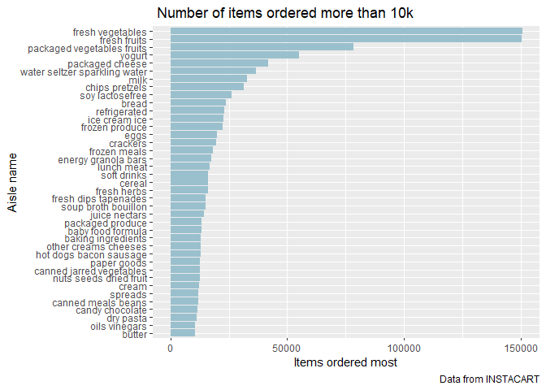

Homework 3
================
Bingkun Luo
10/10/2019

# Problem 1

## a

``` r
aisle = instacart%>%
        group_by(aisle)%>%
        summarize(count=n()) %>%
        arrange(desc(count))

most = which.max(pull(aisle,count))
```

  - There are **134** aisles and the **fresh vegetables** are the most
    items ordered from.

## b

``` r
aisle_10k = aisle %>%
            filter(count>10000) %>%
            arrange(desc(count))

ggplot(aisle_10k,aes(x = reorder(aisle,count), y = count))+
  geom_bar(stat="identity",fill="lightblue3" )+ 
  coord_flip()+
  labs(
    title = " Number of items ordered more than 10k",
    x = "Aisle name",
    y = "Items ordered most",
    caption = "Data from INSTACART")
```

<!-- -->

## c

``` r
pop_baking_items = instacart %>% 
            filter(aisle == "baking ingredients")%>%
            group_by(aisle,product_name)%>%
            summarize(n()) %>%
            top_n(3)
```

    ## Selecting by n()

``` r
pop_dog_items = instacart %>% 
            filter(aisle == "dog food care")%>%
            group_by(aisle,product_name)%>%
            summarize(n()) %>%
            top_n(3)
```

    ## Selecting by n()

``` r
pop_vege_items = instacart %>% 
            filter(aisle == "packaged vegetables fruits")%>%
            group_by(aisle,product_name)%>%
            summarize(n()) %>%
            top_n(3)
```

    ## Selecting by n()

``` r
rbind(pop_baking_items,pop_dog_items,pop_vege_items)
```

    ## # A tibble: 9 x 3
    ## # Groups:   aisle [3]
    ##   aisle                     product_name                              `n()`
    ##   <chr>                     <chr>                                     <int>
    ## 1 baking ingredients        Cane Sugar                                  336
    ## 2 baking ingredients        Light Brown Sugar                           499
    ## 3 baking ingredients        Pure Baking Soda                            387
    ## 4 dog food care             Organix Chicken & Brown Rice Recipe          28
    ## 5 dog food care             Small Dog Biscuits                           26
    ## 6 dog food care             Snack Sticks Chicken & Rice Recipe Dog T~    30
    ## 7 packaged vegetables frui~ Organic Baby Spinach                       9784
    ## 8 packaged vegetables frui~ Organic Blueberries                        4966
    ## 9 packaged vegetables frui~ Organic Raspberries                        5546
