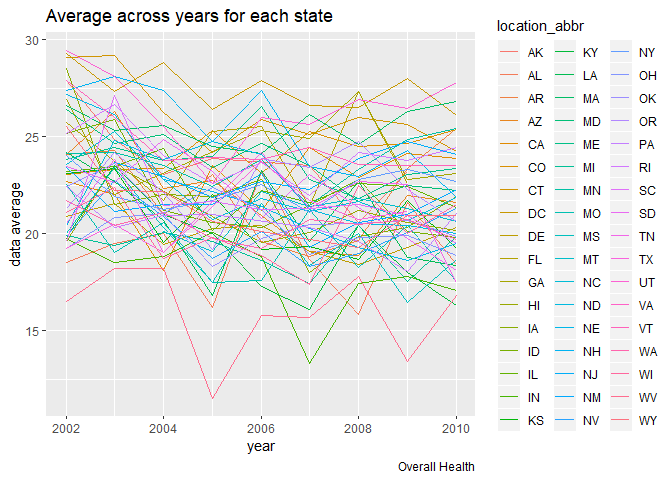
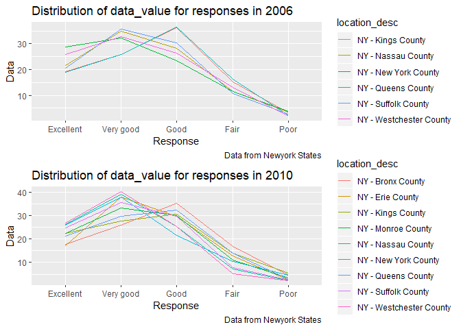

Homework 3
================
Bingkun Luo
10/10/2019

# Problem 1

## a

``` r
aisle = instacart%>%
        group_by(aisle)%>%
        summarize(count=n()) %>%
        arrange(desc(count))

most = which.max(pull(aisle,count))
```

  - There are **134** aisles and the **fresh vegetables** are the most
    items ordered from.

## b

``` r
aisle_10k = aisle %>%
            filter(count>10000) %>%
            arrange(desc(count))

ggplot(aisle_10k,aes(x = reorder(aisle,count), y = count))+
  geom_bar(stat="identity",fill="lightblue3" )+ 
  coord_flip()+
  labs(
    title = " Number of items ordered more than 10k",
    x = "Aisle name",
    y = "Items ordered most",
    caption = "Data from INSTACART")
```

<!-- -->

## c

``` r
pop_items = instacart %>% 
            filter(aisle == "baking ingredients"|aisle == "dog food care"|aisle ==                  "packaged vegetables fruits")%>%
            group_by(aisle,product_name)%>%
            summarize(n()) %>%
            top_n(3)
```

    ## Selecting by n()

``` r
pop_items
```

    ## # A tibble: 9 x 3
    ## # Groups:   aisle [3]
    ##   aisle                     product_name                              `n()`
    ##   <chr>                     <chr>                                     <int>
    ## 1 baking ingredients        Cane Sugar                                  336
    ## 2 baking ingredients        Light Brown Sugar                           499
    ## 3 baking ingredients        Pure Baking Soda                            387
    ## 4 dog food care             Organix Chicken & Brown Rice Recipe          28
    ## 5 dog food care             Small Dog Biscuits                           26
    ## 6 dog food care             Snack Sticks Chicken & Rice Recipe Dog T~    30
    ## 7 packaged vegetables frui~ Organic Baby Spinach                       9784
    ## 8 packaged vegetables frui~ Organic Blueberries                        4966
    ## 9 packaged vegetables frui~ Organic Raspberries                        5546

## d

``` r
library(data.table)
```

    ## 
    ## Attaching package: 'data.table'

    ## The following objects are masked from 'package:dplyr':
    ## 
    ##     between, first, last

    ## The following object is masked from 'package:purrr':
    ## 
    ##     transpose

``` r
Ordered_time_apple = instacart%>%
              filter(department == "produce")%>%
              filter(product_name %like% "Pink Lady")%>%
              group_by(order_dow) %>% 
              summarise(mean_hours = mean(order_hour_of_day)) %>% 
              mutate(product_name='Pink Lady Apple')%>%
              select(product_name,order_dow,mean_hours) 

Ordered_time_coffee = instacart%>%
              filter(aisle == "ice cream ice")%>%
              filter(product_name %like% "Coffee")%>%
              group_by(order_dow) %>% 
              summarise(mean_hours = mean(order_hour_of_day)) %>% 
              mutate(product_name='Coffee Ice Cream')%>%
              select(product_name,order_dow,mean_hours)

Order = rbind(Ordered_time_apple,Ordered_time_coffee)
pivot_wider(Order,names_from = order_dow,values_from = mean_hours)
```

    ## # A tibble: 2 x 8
    ##   product_name       `0`   `1`   `2`   `3`   `4`   `5`   `6`
    ##   <chr>            <dbl> <dbl> <dbl> <dbl> <dbl> <dbl> <dbl>
    ## 1 Pink Lady Apple   13.9  12.3  12.4  13.7  12.6  13.1  13.4
    ## 2 Coffee Ice Cream  13.4  14.3  14.4  14.3  14.5  13.4  14.4

# Problem 2

## Data cleaning

``` r
brfss_smart = brfss_smart2010%>%
                  janitor::clean_names()%>%
                  select(location_abbr = locationabbr,location_desc = locationdesc,   resp_id = respid,everything())%>%
                  filter(topic == "Overall Health")

my_levels = c("Excellent","Very good","Good","Fair","Poor")
response_adj = factor(pull(brfss_smart,response),levels = my_levels)
                  
brfss = brfss_smart%>%
        mutate(response_adj)%>%
        select(response_adj,everything(),-response)%>%
        arrange(desc(response_adj))
```

## a

``` r
observed_2002 = brfss%>%
           filter(year == 2002)%>%
           group_by(location_abbr)%>%
           summarize(count=n())%>%
           filter(count/5>=7)%>%
           mutate(year = 2002)
  
observed_2010 = brfss%>%
           filter(year == 2010)%>%
           group_by(location_abbr)%>%
           summarize(count=n())%>%
           filter(count/5>=7)%>%
           mutate(year = 2010)
```

  - In 2002,The states *CT, FL, MA, NC, NJ, PA* were observed at 7 or
    more locations. And in year 2010, *CA, CO, FL, MA, MD, NC, NE, NJ,
    NY, OH, PA, SC, TX, WA* were observed at 7 or more locations.

## b

``` r
subset = brfss%>%
         filter(response_adj == "Excellent")%>%
         select(year,location_abbr,data_value)%>%
         group_by(year,location_abbr)%>%
         mutate(average = mean(data_value))%>%
         select(-data_value)%>%
         distinct() 

ggplot(subset,aes(x=year,y=average,col=location_abbr))+ 
  geom_line(aes(group = location_abbr))
```

    ## Warning: Removed 3 rows containing missing values (geom_path).

<!-- -->

## c

``` r
library(gridExtra)
```

    ## 
    ## Attaching package: 'gridExtra'

    ## The following object is masked from 'package:dplyr':
    ## 
    ##     combine

``` r
NY_2006 = brfss%>%
          filter(year == 2006 & location_abbr == "NY")
plot_2006 = 
  ggplot(NY_2006,
         aes(x=response_adj, y = data_value,color = location_desc,group=location_desc))+
  geom_line()+
  labs(
    title = "Distribution of data_value for responses in 2006",
    x = "Response",
    y = "Data",
    caption = "Data from Newyork States")

NY_2010 = brfss%>%
          filter(year == 2010 & location_abbr == "NY")
plot_2010 = 
  ggplot(NY_2010,
         aes(x=response_adj, y = data_value,color=location_desc,group=location_desc))+
  geom_line()+
  labs(
    title = "Distribution of data_value for responses in 2010",
    x = "Response",
    y = "Data",
    caption = "Data from Newyork States")

grid.arrange(plot_2006, plot_2010, nrow = 2)
```

<!-- -->

# Problem 3

## a

``` r
accel_data = 
  read_csv(file = "./accel_data.csv")%>%
  janitor::clean_names()
```

    ## Parsed with column specification:
    ## cols(
    ##   .default = col_double(),
    ##   day = col_character()
    ## )

    ## See spec(...) for full column specifications.
