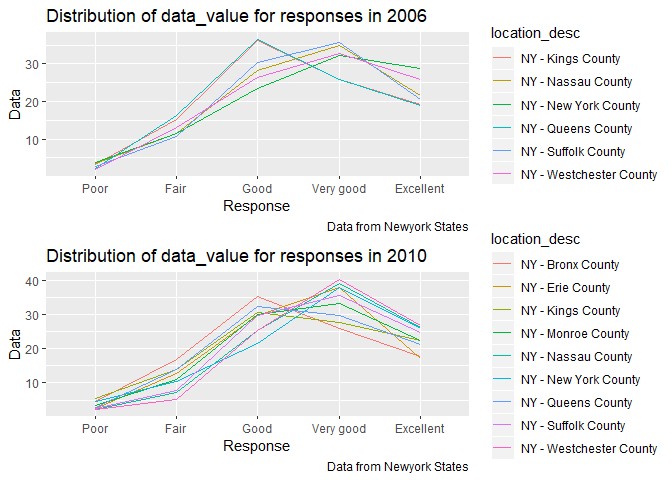
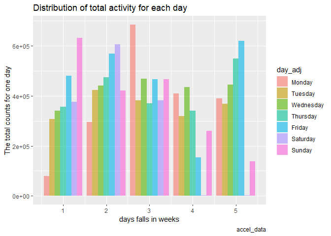
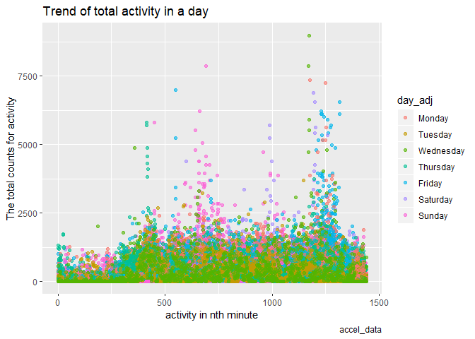

Homework 3
================
Bingkun Luo
10/10/2019

# Problem 1

## a

  - The instacart data set should contain 1384617 observations and 15
    variables. and the type of varibles are listed below

<!-- end list -->

``` r
data("instacart")
str(instacart)
```

    ## Classes 'tbl_df', 'tbl' and 'data.frame':    1384617 obs. of  15 variables:
    ##  $ order_id              : int  1 1 1 1 1 1 1 1 36 36 ...
    ##  $ product_id            : int  49302 11109 10246 49683 43633 13176 47209 22035 39612 19660 ...
    ##  $ add_to_cart_order     : int  1 2 3 4 5 6 7 8 1 2 ...
    ##  $ reordered             : int  1 1 0 0 1 0 0 1 0 1 ...
    ##  $ user_id               : int  112108 112108 112108 112108 112108 112108 112108 112108 79431 79431 ...
    ##  $ eval_set              : chr  "train" "train" "train" "train" ...
    ##  $ order_number          : int  4 4 4 4 4 4 4 4 23 23 ...
    ##  $ order_dow             : int  4 4 4 4 4 4 4 4 6 6 ...
    ##  $ order_hour_of_day     : int  10 10 10 10 10 10 10 10 18 18 ...
    ##  $ days_since_prior_order: int  9 9 9 9 9 9 9 9 30 30 ...
    ##  $ product_name          : chr  "Bulgarian Yogurt" "Organic 4% Milk Fat Whole Milk Cottage Cheese" "Organic Celery Hearts" "Cucumber Kirby" ...
    ##  $ aisle_id              : int  120 108 83 83 95 24 24 21 2 115 ...
    ##  $ department_id         : int  16 16 4 4 15 4 4 16 16 7 ...
    ##  $ aisle                 : chr  "yogurt" "other creams cheeses" "fresh vegetables" "fresh vegetables" ...
    ##  $ department            : chr  "dairy eggs" "dairy eggs" "produce" "produce" ...
    ##  - attr(*, "spec")=
    ##   .. cols(
    ##   ..   order_id = col_integer(),
    ##   ..   product_id = col_integer(),
    ##   ..   add_to_cart_order = col_integer(),
    ##   ..   reordered = col_integer(),
    ##   ..   user_id = col_integer(),
    ##   ..   eval_set = col_character(),
    ##   ..   order_number = col_integer(),
    ##   ..   order_dow = col_integer(),
    ##   ..   order_hour_of_day = col_integer(),
    ##   ..   days_since_prior_order = col_integer(),
    ##   ..   product_name = col_character(),
    ##   ..   aisle_id = col_integer(),
    ##   ..   department_id = col_integer(),
    ##   ..   aisle = col_character(),
    ##   ..   department = col_character()
    ##   .. )

``` r
aisle = instacart%>%
        group_by(aisle)%>%
        summarize(count=n()) %>%
        arrange(desc(count))

most = which.max(pull(aisle,count))
```

  - There are **134** aisles and the **fresh vegetables** are the most
    items ordered from.

## b

``` r
aisle_10k = aisle %>%
            filter(count>10000) %>%
            arrange(desc(count))

ggplot(aisle_10k,aes(x = reorder(aisle,count), y = count))+
  geom_bar(stat="identity",fill="lightblue3" )+ 
  coord_flip()+
  labs(
    title = " Number of items ordered more than 10k",
    x = "Aisle name",
    y = "Items ordered most",
    caption = "Data from INSTACART")
```

<!-- -->

  - For the products ordered more than 10,000 times,fresh vegetables and
    fruits are the most popular in the instacart.

## c

``` r
pop_items = instacart %>% 
            filter(aisle == "baking ingredients"|aisle == "dog food care"|aisle ==                  "packaged vegetables fruits")%>%
            group_by(aisle,product_name)%>%
            summarize(count =n()) %>%
            top_n(3)%>%
            arrange(desc(count))
```

    ## Selecting by count

``` r
pop_items
```

    ## # A tibble: 9 x 3
    ## # Groups:   aisle [3]
    ##   aisle                     product_name                              count
    ##   <chr>                     <chr>                                     <int>
    ## 1 packaged vegetables frui~ Organic Baby Spinach                       9784
    ## 2 packaged vegetables frui~ Organic Raspberries                        5546
    ## 3 packaged vegetables frui~ Organic Blueberries                        4966
    ## 4 baking ingredients        Light Brown Sugar                           499
    ## 5 baking ingredients        Pure Baking Soda                            387
    ## 6 baking ingredients        Cane Sugar                                  336
    ## 7 dog food care             Snack Sticks Chicken & Rice Recipe Dog T~    30
    ## 8 dog food care             Organix Chicken & Brown Rice Recipe          28
    ## 9 dog food care             Small Dog Biscuits                           26

  - The top 3 best sells among packaged vegetables fruits are all
    organic foods, including Spinach, Raspberries, blueberries.
  - The top 3 baking ingredients is Light Brown Bugar,Pure Baking Soda
    and Cane Sugar.
  - The top 3 dog fod is Snack Sticks Chicken & Rice Recipe Dog
    Treats,Organix Chicken & Brown Rice Recipe and Small Dog Biscuits.

## d

``` r
library(data.table)

Ordered_time_apple = instacart%>%
              filter(department == "produce")%>%
              filter(product_name %like% "Pink Lady")%>%
              group_by(order_dow) %>% 
              summarise(mean_hours = mean(order_hour_of_day)) %>% 
              mutate(product_name='Pink Lady Apple')%>%
              select(product_name,order_dow,mean_hours) 

Ordered_time_coffee = instacart%>%
              filter(aisle == "ice cream ice")%>%
              filter(product_name %like% "Coffee")%>%
              group_by(order_dow) %>% 
              summarise(mean_hours = mean(order_hour_of_day)) %>% 
              mutate(product_name='Coffee Ice Cream')%>%
              select(product_name,order_dow,mean_hours)

Order = rbind(Ordered_time_apple,Ordered_time_coffee)
pivot_wider(Order,names_from = order_dow,values_from = mean_hours)
```

    ## # A tibble: 2 x 8
    ##   product_name       `0`   `1`   `2`   `3`   `4`   `5`   `6`
    ##   <chr>            <dbl> <dbl> <dbl> <dbl> <dbl> <dbl> <dbl>
    ## 1 Pink Lady Apple   13.9  12.3  12.4  13.7  12.6  13.1  13.4
    ## 2 Coffee Ice Cream  13.4  14.3  14.4  14.3  14.5  13.4  14.4

  - People are most likely to buy Pink lady apple arould 13:00 and
    Coffee Ice cream at 14:00 in each day of the week, and also the 0
    stands for Sunday, 1 for Monday,2 for Tuesday and etc. still 6 to
    Saturday.

# Problem 2

## Data cleaning

``` r
brfss_smart = brfss_smart2010%>%
                  janitor::clean_names()%>%
                  select(location_abbr = locationabbr,location_desc = locationdesc,   resp_id = respid,everything())%>%
                  filter(topic == "Overall Health")

my_levels = c("Poor","Fair","Good","Very good","Excellent")
response_adj = factor(pull(brfss_smart,response),levels = my_levels)
                  
brfss = brfss_smart%>%
        mutate(response_adj)%>%
        select(response_adj,everything(),-response)%>%
        arrange(response_adj)
```

## a

``` r
observed_2002 = brfss%>%
           filter(year == 2002)%>%
           group_by(location_abbr)%>%
           summarize(count=n())%>%
           filter(count/5>=7)%>%
           mutate(year = 2002)
  
observed_2010 = brfss%>%
           filter(year == 2010)%>%
           group_by(location_abbr)%>%
           summarize(count=n())%>%
           filter(count/5>=7)%>%
           mutate(year = 2010)
```

  - In 2002,The states *CT, FL, MA, NC, NJ, PA* were observed at 7 or
    more locations. And in year 2010, *CA, CO, FL, MA, MD, NC, NE, NJ,
    NY, OH, PA, SC, TX, WA* were observed at 7 or more locations.

## b

``` r
subset = brfss%>%
         filter(response_adj == "Excellent")%>%
         select(year,location_abbr,data_value)%>%
         group_by(year,location_abbr)%>%
         mutate(average = mean(data_value))%>%
         drop_na()%>%
         select(-data_value)%>%
         distinct() 

ggplot(subset,aes(x=year,y=average,col=location_abbr))+ 
  geom_line(aes(group = location_abbr))+
  labs(
    title = "Average across years for each state",
    x = "year",
    y = "data average",
    caption = "Overall Health") 
```

<!-- -->

  - Since there are 51 states here the color is a little hard for me to
    distinguish from each other. The trend shows that overall health in
    Execent has been decreased across states. And at year 2005, we can
    observe a extreme decrease.

## c

``` r
library(gridExtra)
```

    ## 
    ## Attaching package: 'gridExtra'

    ## The following object is masked from 'package:dplyr':
    ## 
    ##     combine

``` r
NY_2006 = brfss%>%
          filter(year == 2006 & location_abbr == "NY")
plot_2006 = 
  ggplot(NY_2006,
         aes(x=response_adj, y = data_value,color = location_desc,group=location_desc))+
  geom_line()+
  labs(
    title = "Distribution of data_value for responses in 2006",
    x = "Response",
    y = "Data",
    caption = "Data from Newyork States")

NY_2010 = brfss%>%
          filter(year == 2010 & location_abbr == "NY")
plot_2010 = 
  ggplot(NY_2010,
         aes(x=response_adj, y = data_value,color=location_desc,group=location_desc))+
  geom_line()+
  labs(
    title = "Distribution of data_value for responses in 2010",
    x = "Response",
    y = "Data",
    caption = "Data from Newyork States")

grid.arrange(plot_2006, plot_2010, nrow = 2)
```

<!-- -->

  - The graph shows that people claim to be *Very good* or *good* are
    actully perform better than excellent in both year 2006 and 2010,
    and actually they are getting better in more recent year in the New
    York area, as the upper limit increases.

# Problem 3

## a

``` r
accel_data = 
  read_csv(file = "./accel_data.csv")%>%
  janitor::clean_names()%>%
  mutate(weekday = ifelse(day %in% c("Monday", "Tuesday","Wednesday","Thursday","Friday"),1,0))%>%
  pivot_longer(activity_1:activity_1440,names_to = "minute",values_to = "activity_counts")%>%
  mutate(minute_number = as.integer(rep(c(1:1440),time = 35)))
```

    ## Parsed with column specification:
    ## cols(
    ##   .default = col_double(),
    ##   day = col_character()
    ## )

    ## See spec(...) for full column specifications.

  - There are 50400 observations and 7 variables, including week,
    day\_id, day, weekday, minute, activity\_counts, minute\_number.

weekday is a binary variable that I created as identifier and the
minute\_number is the integer for activities at nth minute. week range
from 1 to 5 in this study.

## b

``` r
aggregate = accel_data%>%
          group_by(week,day_id,day) %>% 
          summarise(sum_of_day = sum(activity_counts))

my_levels = c("Monday","Tuesday","Wednesday","Thursday","Friday","Saturday","Sunday")
day_adj = factor(pull(accel_data,day),levels = my_levels)

aggregate_day = accel_data%>%
                mutate(day_adj)%>%
                group_by(week,day_id,day_adj)%>% 
                summarise(sum_of_day = sum(activity_counts))%>%
                arrange(day_adj)
aggregate_day
```

    ## # A tibble: 35 x 4
    ## # Groups:   week, day_id [35]
    ##     week day_id day_adj sum_of_day
    ##    <dbl>  <dbl> <fct>        <dbl>
    ##  1     1      2 Monday      78828.
    ##  2     2      9 Monday     295431 
    ##  3     3     16 Monday     685910 
    ##  4     4     23 Monday     409450 
    ##  5     5     30 Monday     389080 
    ##  6     1      6 Tuesday    307094.
    ##  7     2     13 Tuesday    423245 
    ##  8     3     20 Tuesday    381507 
    ##  9     4     27 Tuesday    319568 
    ## 10     5     34 Tuesday    367824 
    ## # ... with 25 more rows

``` r
ggplot(aggregate_day,aes(x=week,y=sum_of_day,fill = day_adj))+
  geom_bar(stat = "identity",alpha = 0.6, position=position_dodge())+ 
  labs(
    title = "Distribution of total activity for each day",
    x = "days falls in weeks",
    y = "The total counts for one day",
    caption = "accel_data") 
```

<!-- -->

  - Are any trends apparent?
  - Week four and five contribute the lowest activity on Saturday, which
    consider something we should look into.

Otherwise, the daily activity is acutally random from records and there
is no certain pattern to look when compiling minute activities to
days.

## c

``` r
my_levels = c("Monday","Tuesday","Wednesday","Thursday","Friday","Saturday","Sunday")
day_adj = factor(pull(accel_data,day),levels = my_levels)

accel = accel_data%>%
        mutate(day_adj)%>%
        group_by(week,day_id,day_adj)
  
  
ggplot(accel, aes(x=minute_number,y=activity_counts,color = day_adj)) + 
  geom_point(alpha = 0.6) + 
  labs(
    title = "Trend of total activity in a day",
    x = "activity in nth minute",
    y = "The total counts for activity",
    caption = "accel_data") 
```

<!-- -->

  - For Thursday, the most freqent activity is on the 400th mintue which
    is around 6-7 am

  - For Monday Wednesday and Friday, the peak is observed at 1250th
    minute, which is around 8-9 pm.

  - For Saturday the most freqent activity is around 1000th and 1250th
    mintue, which is 4-9 pm.

  - For Sunday the most freqent activity is around 700th mintue, which
    is lunch time 11am-12pm.
